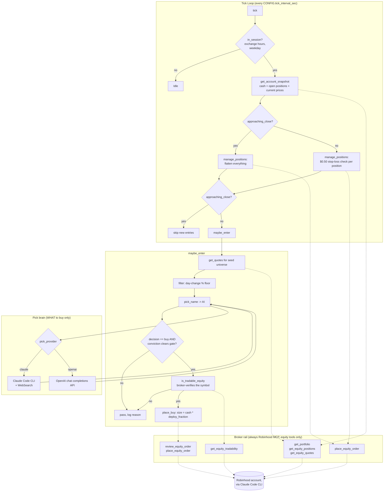

# High-Speed Trader — Design Doc

`high_speed_trader.py` is a stateless, high-speed, equity-only intraday
trading loop for a Robinhood account. It implements the rules defined in
[`SKILLS.md`](../SKILLS.md); this doc covers *how* it implements them.

## Goals (from SKILLS.md)

- Unlimited trades per session, evaluated on a fast, fixed-interval tick.
- Hard stop-loss: exit a position the instant it's down $0.50/share from its
  entry price. Take-profit is uncapped — no forced exit while ahead.
- Equity/stock instrument only. No options, futures, or other derivatives.
- A seed universe is a guideline, not a boundary.
- Trade only during regular exchange hours.
- No state is stored. Every tick re-reads live broker state.

## Non-goals

- Options, shorting, or any instrument besides long equity.
- Persisting positions, fills, or P&L across ticks or process restarts.
- Backtesting or a paper-trading ledger (use `--simulation` for a dry run
  against live quotes instead).

## Architecture

### Component notes

- **Tick loop** (`tick`, `main`): the only thing that runs on a schedule. No
  component below it retains anything between calls — each tick is a fresh
  read-decide-act cycle.
- **Broker rail**: every quote, position, cash, and order call is a scoped
  `claude -p` headless call with `--allowedTools` restricted to a specific
  `mcp__robinhood__*` tool (see `mcp_tools()`). This is the *only* path to
  the account, regardless of `pick_provider` — it never changes.
- **Pick brain**: `pick_name` routes to `pick_via_claude` (Claude Code CLI,
  `WebSearch` allowed, no MCP tools allowed) or `pick_via_openai` (raw HTTPS
  call to the OpenAI chat completions endpoint). Either path returns a
  symbol/conviction/reason JSON blob and nothing else — it cannot place
  orders or read the account directly.
- **Risk math**: sizing (`deploy_fraction` of settled cash), the $0.50
  stop-loss, the close-out guard, and the conviction gate are all plain
  deterministic Python in `manage_positions` / `maybe_enter`. The AI only
  ever answers "what to buy."
- **Tradability guard**: because the seed universe is a guideline and not a
  boundary, any symbol the AI proposes — in or out of `CONFIG["universe"]` —
  is checked with `get_equity_tradability` before an order is placed.

## Data flow per tick

1. `now_tz()` — current time in `CONFIG["tz"]`.
2. `in_session(now)` — exchange-hours + weekday gate. `False` → idle, nothing
   else runs this tick.
3. `get_account_snapshot()` — live `settled_cash` and every open equity
   position, each enriched with its current price via one batched
   `get_equity_quotes` call.
4. `in_close_out_window(now)` — inside `close_out_minutes_before_close` of
   the bell?
5. `manage_positions(snapshot, approaching_close)` — per open position: sell
   if `approaching_close`, or if `entry - current >= stop_loss_usd`.
   Otherwise hold; upside is never capped here.
6. If not approaching close: `maybe_enter(snapshot)` — quote the seed
   universe, filter by `candidate_min_daychg`, hand the shortlist to
   `pick_name`, gate on conviction, verify tradability, size the trade as
   `settled_cash * deploy_fraction`, and buy if `enable_live_buys` is `True`.

## Safety gates

- `CONFIG["enable_live_buys"]` defaults to `False`. Sells (stop-loss,
  close-out) always run live, since they only reduce risk; buys stay off
  until this is deliberately flipped on.
- `--simulation` runs the full read/decide path (including a real AI pick
  call) without calling `place_buy` or `place_sell_all`.
- `is_tradable_equity` rejects anything the broker doesn't recognize before
  a buy is attempted, which matters once the AI is free to propose names
  outside the seed universe.

## Configuration surface

All knobs live in the `CONFIG` dict at the top of `high_speed_trader.py`.
`--interval`, `--session-open`, `--session-close`, and `--ignore-weekday`
override the matching `CONFIG` entry when passed on the command line;
otherwise the `CONFIG` value is used. See `README.md` for the full list.

## Known limitations / open questions

- The stop-loss compares against the broker-reported `average_buy_price`,
  not the price at the moment *this bot* entered — if you also trade the
  same symbol manually, its average cost basis (and therefore the stop)
  shifts accordingly.
- No per-symbol or portfolio-wide daily loss breaker exists (unlike
  `sample.py`'s `max_daily_loss_usd`) — SKILLS.md doesn't call for one,
  since "any number of trades are allowed." Add one if you want a circuit
  breaker.
- Single-threaded, single-process. Concurrent positions are supported, but
  there's no order-book awareness beyond a plain market order per action.
